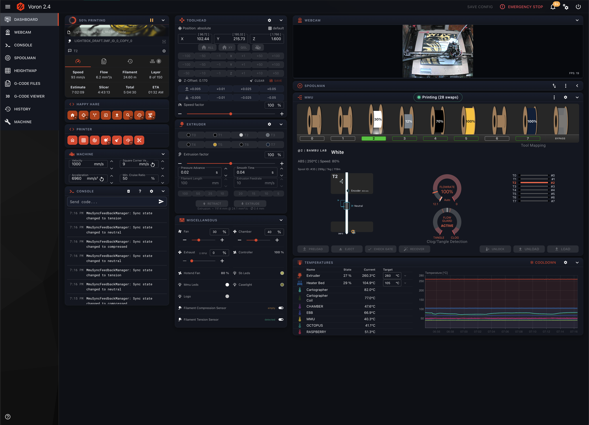

# Voron Carbon

Voron Carbon is a standalone Happy Hare front end for Voron printers running Klipper and Moonraker. It provides
a focused printer and MMU dashboard while leaving Mainsail or Fluidd installed and reachable alongside it.

Nine pages: **dashboard · console · webcam · spoolman · heightmap · files · viewer · history · config · machine**.

## Install over SSH

On a printer host that already runs Moonraker and nginx, these steps install Carbon on port **8767** without
replacing your existing web interface. Replace `PI_USER` with the Linux user on your printer host (often `pi`)
and `PRINTER_HOST` with its hostname or IP address.

1. From a terminal on your computer, connect to the printer host:

   ```bash
   ssh PI_USER@PRINTER_HOST
   ```

2. Clone Voron Carbon on the printer host:

   ```bash
   git clone https://github.com/olitetu/voron-carbon.git "$HOME/voron-carbon"
   cd "$HOME/voron-carbon"
   ```

3. Run the installer and follow its confirmation prompt:

   ```bash
   bash tools/install.sh --root "$PWD/dist"
   ```

   The installer checks nginx and Moonraker, validates the generated nginx configuration before enabling it,
   and leaves your existing Mainsail or Fluidd site untouched. To preview every change first, add `--dry-run`.

4. Open Carbon in a browser:

   ```text
   http://PRINTER_HOST:8767/
   ```

To update this checkout later, SSH to the printer again and run:

```bash
cd "$HOME/voron-carbon"
git pull --ff-only
```

## Dashboard



## Layout

```
design-src/          the original design export (template, logic, runtime, screenshots) — reference only
src/lib/
  moonraker.js       WebSocket JSON-RPC + REST client
  store.js           observable store; `raw` mirrors Moonraker's printer objects (deep-merged)
  boot.js            wires client → store: subscriptions, hydration, the command catalogue, cutter events
  caps.js            "does this printer have command X?" over the latched printer.gcode.commands catalogue
  useStore.js        useStore / useAsync / usePersisted — every page's re-render and persistence
  design.jsx         the shared primitives: Panel, Btn, Chip, Label, Val, Row, Table, Menu, Confirm, T tokens
  ui.js              S() css→style memo, Hv (real CSS :hover rules, not React state)
  geometry.js        the filament path in millimetres, read from live Happy Hare config
  hh.js              Happy Hare state helpers (filament_pos anchors, action→phase table)
  router.js          hash router + route persistence (Orca reloads the page constantly — see below)
  actions/           one module per panel: make<Panel>Actions({api, store, log}) → real gcode / RPC
src/pages/dashboard/
  Template.jsx       GENERATED from design-src/template_body.html — never hand-edit
  logic.jsx          the design's view-model (renderVals) + UI-local state; merges every adapter
  adapters/          one module per panel: <panel>Vals(ctx) → that panel's template keys, from live state
src/pages/<page>/    the other eight pages
src/viewer/          entry for the lazily-loaded 3D G-code bundle (gcode-preview + three)
src/editor/          entry for the lazily-loaded CodeMirror 6 bundle + the Klipper/Jinja language mode
vendor/              React 18.3.1 UMD — no runtime internet dependency (fonts are vendored into dist/ too)
dist/                build output; this is what runs on the printer. Committed on purpose — see below.
tools/               see "Tooling"
CONTRACT.md          the authoritative spec (store shape, API, exact gcode per action, page parity)
```

### The generated dashboard

`Template.jsx` is produced mechanically from the design export, so the layout stays pixel-faithful and a design
re-export does not have to be re-implemented by hand:

```bash
python3 tools/dc2jsx.py design-src/template_body.html src/pages/dashboard/Template.jsx
python3 tools/patch_template.py        # 33 rules that bind design literals to live V.* keys
```

`patch_template.py` **fails loudly**: every rule must match exactly the expected number of times, so a re-export
that moves the markup can never silently leave a dead literal (or a dead binding) on screen. Never hand-edit
`Template.jsx` — put the change in a patch rule instead.

## Build

```bash
npm install     # devDependencies only: esbuild, and the two vendored bundles' sources
npm run build   # → dist/  (npm run watch for rebuild-on-save)
```

Three bundles, all IIFE, all built from vendored sources — nothing is fetched at runtime:

| bundle | raw | gzip | loaded |
|---|---|---|---|
| `app.js` | 406 KB | 119 KB | always |
| `viewer.js` | 705 KB | 181 KB | lazily, on entering `#/viewer` |
| `editor.js` | 402 KB | 130 KB | lazily, on entering `#/config` |

Plus `base.css`, `index.html`, 30 vendored woff2 faces (324 KB) and React UMD. The viewer and editor bundles are
skipped cleanly if their npm packages are absent, so a fresh clone still builds.

`npm install` runs `tools/patch_gcode_preview.py`, which fixes two measured allocation defects in
`gcode-preview` (a per-path geometry that is never disposed, and a 3× over-allocated `BatchedMesh` buffer). It is
idempotent and prints `already` on a second run. Without it the median 22 MB G-code file needs ~570 MB of typed
arrays instead of ~141 MB.

## Develop

```bash
npm run watch
(cd dist && python3 -m http.server 8766)   # → http://127.0.0.1:8766/
```

Port **8766** is special-cased in `lib/boot.js`: on it the app talks to `http://voron.local` instead of its own
origin, so the local build drives the real printer. Override with `?api=http://<host>` or
`localStorage.setItem('carbon.api', 'http://<host>')` — both are honoured **only** on the dev port, so production
is unconditionally same-origin.

Dev handles in the browser console: `window.__V` (the whole dashboard view-model), `window.__carbon`
(`{api, store, geometry, travelForMm, act}`), `window.__perf`.

## Deploy to the printer

**Install (any printer).** Download `voron-carbon.zip` from a release, unpack it on the printer, and run the
installer that ships inside it:

```bash
mkdir -p ~/printer_data/carbon && cd ~/printer_data/carbon
unzip -o ~/voron-carbon.zip
bash tools/install.sh                  # --dry-run first if you want to read the config it generates
```

It auto-detects your nginx layout, Moonraker port and install directory, generates a config from those,
validates with `nginx -t` **before** enabling anything, and backs itself out completely if the test fails. It
never edits a file it did not create and never changes permissions behind your back. `--help` lists the flags
(`--port`, `--moonraker-port`, `--webcam-port`, `--root`).

**Development builds.** To push a work-in-progress build without cutting a release:

```bash
export CARBON_PRINTER=http://myprinter.local     # once, in your shell profile
npm run build && python3 tools/deploy.py         # uploads over the Moonraker file API — no SSH
```

That lands in Moonraker's `config` root and is viewable at
`<printer>/server/files/config/voron-ui/carbon/dist/index.html`, leaving the real install untouched.

### Keeping it updated

Register Carbon with Moonraker's update manager and it updates itself from the MACHINE page, alongside
Klipper and everything else. Append to `~/printer_data/config/moonraker.conf`, then restart Moonraker:

```ini
[update_manager voron-carbon]
type: web
channel: stable
repo: olitetu/voron-carbon
path: ~/printer_data/carbon        # the directory you installed into
refresh_interval: 24
```

`path` must exist, must contain `release_info.json` (the release zip ships one), and must NOT be inside a
git repo. Moonraker makes that directory read-only to its own file API once registered — which is why
`tools/deploy.py` writes somewhere else entirely.

Rolling back: press **Rollback** on the card, or mark the bad release as a pre-release
(`gh release edit v1.2.0 --prerelease`) and update again — `releases/latest` then resolves to the previous
one. Carbon is only static files, so the worst case is unzipping an older release by hand.

### Why its own port, and not a sub-path

The obvious `location /carbon/` under Mainsail's nginx **does not work**. Mainsail ships a root-scoped service
worker whose `navigateFallbackDenylist` is only `[/^\/(access|api|printer|server|websocket)/, /^\/webcam[2-4]?/]`
— so a navigation to `/carbon/` is served Mainsail's cached shell instead. A separate port is a separate origin,
which sidesteps the service worker entirely, keeps the app same-origin with the Moonraker API (no CORS, and
Tornado's `check_origin` compares host *with* port — hence `proxy_set_header Host $http_host` in the nginx conf,
which is load-bearing), and makes Carbon a peer of Mainsail rather than a guest inside it.

### Interim URL, before the port is installed

`http://<printer>/server/files/config/voron-ui/carbon/dist/index.html` works today — it is same-origin, and
`/server/` is one of the paths Mainsail's service worker *does* denylist.

## Running inside OrcaSlicer

Orca 2.4.2's **Device** tab renders any URL in the printer preset's `print_host_webui` field ("Device UI",
visible in Advanced/Expert mode). Point it at Carbon's port and Carbon becomes your Orca device tab:

| Orca field | value |
|---|---|
| Host Type | `Octo/Klipper` |
| `print_host` | `http://<printer>:8767` |
| **Device UI** (`print_host_webui`) | `http://<printer>:8767` |
| API Key | **leave empty** |
| Support 3MF as gcode | off |

Leave the API key empty: a non-empty key makes Orca inject a `window.fetch` monkey-patch and then reload, so the
page loads twice on every navigation — and it patches only `fetch`, never `WebSocket`, so it would not reach the
Moonraker socket anyway.

Three constraints this places on the code, permanently:

- **No `target="_blank"` and no `window.open`** — Orca's `OnNewWindow` handler ejects the user out to their
  system browser and cancels the navigation. Use an in-page `<iframe>` or same-tab navigation.
- **No service workers** — `http://…:8767` is not a potentially-trustworthy origin, so registration throws.
- **The page is destroyed and reloaded at the base URL constantly** (Orca reloads on nearly every preset change,
  with no same-URL guard). So the route and every user selection — filters, sort, open tabs, selected file,
  unsent console input — are persisted to `localStorage` via `usePersisted` and `router.restoreRoute()`.

## Tooling

| tool | what it does |
|---|---|
| `dc2jsx.py` | design HTML → `Template.jsx` (also html-unescapes text, so `&amp;` never reaches the UI) |
| `patch_template.py` | 33 binding rules over the generated template; fails loudly if the design moves |
| `deploy.py` | uploads `dist/` + `tools/` to `config/voron-ui/carbon/` over the Moonraker file API |
| `install.sh` | portable installer: detects the host, generates the nginx config, validates before enabling, backs out on failure |
| `patch_gcode_preview.py` | the two allocation fixes; runs from `postinstall` |

## Design rules

Tokens live in `design.jsx` as `T`. Hairline 1 px borders in `T.line`, radii 3–6 px, **no box-shadows** (the
`Menu`, the E-STOP and the upload chip are the deliberate exceptions), mono uppercase micro-labels with
letter-spacing, dark panels on near-black. Dense and technical, never airy.

Two rules that are easy to get wrong:

- **Every page calls `useStore(store)` first.** A page is handed to the shell as a prop *element*, and React
  bails out of re-rendering a child whose element reference has not changed — so a page that reads
  `store.state` directly would show permanently stale data.
- **Capability checks go through `caps.js`**, never through `printer.objects.list`. Only
  `printer.gcode.commands` sees all three kinds of command at once: `[gcode_macro X]` macros, natives that come
  from a config section (`QUAD_GANTRY_LEVEL`, `Z_OFFSET_APPLY_PROBE`), and commands registered by a Python module
  (every `MMU_*`). `has()` returns `null` when the catalogue has not loaded yet — treat that as *available*, not
  absent, or the UI greys itself out during startup.

## Why `dist/` is committed

The printer pulls prebuilt files, so it needs no Node or npm toolchain to update, and a deploy is a file copy
rather than a build. Source maps are `.gitignore`d — they are 5.9 MB of the 7.8 MB output and the printer never
reads them.
